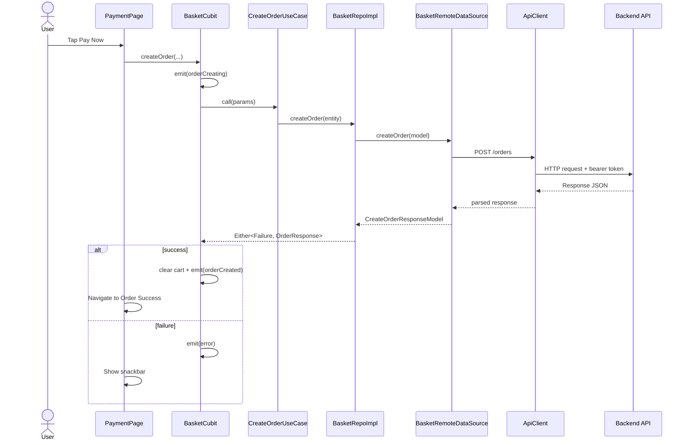

# Laundry App

Professional mobile client for an on-demand laundry business, built with Flutter.

This README is written as a technical compass for new engineers inheriting the project.

## 🚀 Executive Summary

Laundry App digitizes the full laundry customer journey:

- Account onboarding and OTP-based authentication
- Service discovery (categories, banners, top services)
- Basket building and checkout scheduling (pickup + delivery)
- Order creation, tracking, and cancellation
- Profile management, subscriptions, and support tickets
- Wallet/payment-method UX (currently partially mocked)

From a business perspective, the app is an operations front-end that converts service discovery into confirmed orders while maintaining post-order engagement through order tracking and support.

## 🧭 Technical Compass

If you are new to the codebase, start here:

| Area | File / Folder | Why It Matters |
|---|---|---|
| App bootstrap | `lib/main.dart` | Startup order, global error hooks, Firebase and notifications init |
| Root app config | `lib/app.dart` | Theme, router wiring, ScreenUtil initialization |
| Dependency graph | `lib/core/di/injection_container.dart` + `lib/core/di/service_locator.dart` | Service lifetimes, feature registrations, singleton vs factory decisions |
| Navigation map | `lib/core/routing/app_router.dart` + `lib/core/routing/routing_names.dart` | Route topology and initial auth gate |
| API foundation | `lib/core/network/api_client.dart` + `lib/core/constants/api_constants.dart` | Base URL, headers, interceptor behavior, endpoint catalog |
| Primary user journeys | `lib/features/auth`, `lib/features/home`, `lib/features/basket`, `lib/features/orders`, `lib/features/profile` | Core product logic |

## 🏗️ Architecture Deep-Dive

### Architectural Pattern

The project uses **Feature-First Clean Architecture** with a **layered structure** inside each feature:

- `presentation`: screens/widgets + Cubits + immutable UI state
- `domain`: repository contracts and use cases
- `data`: repository implementations, data sources, API/storage models
- `core`: cross-cutting infrastructure (routing, DI, network, services, shared UI)

### Layer Responsibilities in This Project

| Layer | Responsibility | Concrete Examples |
|---|---|---|
| Presentation | Handles user events and renders state-driven UI | `AuthCubit`, `BasketCubit`, `OrdersCubit`, `SupportCubit`, pages under each feature |
| Domain | Defines business contracts and orchestrates use cases | `AuthRepo`, `CreateOrderUseCase`, `GetTicketsUseCase` |
| Data | Talks to API/cache, maps exceptions into failures | `AuthRepoImpl`, `OrdersRemoteDataSourceImpl`, `ProfileLocalDataSourceImpl` |
| Core | Reusable infrastructure and app-wide standards | `ApiClient`, `LocalStorageService`, `AppRouter`, `setupDependencies()` |

### Folder Structure (High-Level)

| Folder | Purpose |
|---|---|
| `lib/core` | Shared technical foundation (networking, routing, DI, theme, utilities, reusable widgets) |
| `lib/features` | Feature modules (`auth`, `home`, `basket`, `orders`, `profile`, `onboarding`, `wallet`, `select_address`) |
| `assets` | Images, icons, fonts |
| `android` / `ios` | Platform-native integration (Firebase, Maps, notifications, build settings) |
| `test` | Automated tests (currently minimal) |

### Architecture Diagram

```mermaid
flowchart LR
	UI[Presentation Screens & Widgets]
	CUBIT[Cubits + Freezed States]
	USECASE[Domain Use Cases]
	REPOIF[Repository Interfaces]
	REPOIMPL[Repository Implementations]
	REMOTE[Remote Data Sources]
	LOCAL[Local Data Sources]
	API[ApiClient (Dio + Auth Interceptor)]
	STORAGE[SharedPreferences / Hive / In-memory Cache]
	BACKEND[REST Backend]

	UI --> CUBIT --> USECASE --> REPOIF --> REPOIMPL
	REPOIMPL --> REMOTE --> API --> BACKEND
	REPOIMPL --> LOCAL --> STORAGE
```

## 🧰 The Tech Stack

### Core Dependencies and Why They Were Chosen

| Category | Packages | Why This Likely Fits the Project |
|---|---|---|
| State management | `flutter_bloc`, `freezed`, `equatable`, `dartz` | Predictable state transitions, immutable states, explicit success/failure handling (`Either`) |
| Networking | `dio`, `pretty_dio_logger`, `connectivity_plus`, `json_serializable` | Strong interceptor support, typed model generation, and resilient online/offline flow control |
| Navigation | `go_router` | Declarative route table with named routes and payload support |
| Dependency injection | `get_it` | Lightweight service locator; simple feature registration and lifecycle control |
| Persistence | `shared_preferences`, `hive_flutter` | Fast key-value persistence for session/config; Hive boxes initialized for local data storage |
| UX/Foundation | `flutter_screenutil`, `google_fonts`, `cached_network_image`, `flutter_svg`, `shimmer`, `intl` | Responsive UI, typography control, image caching, and polished loading/presentation |
| Device/platform services | `image_picker`, `url_launcher`, `geolocator`, `geocoding`, `google_maps_flutter` | Profile media, deep links, geolocation and map address picking |
| Messaging | `firebase_core`, `firebase_messaging`, `flutter_local_notifications` | Push notifications with foreground/background routing into app screens |

## 🔄 State Management Logic

### How Data Flows (UI ➜ Backend ➜ UI)

1. User interacts with a screen (for example, tap **Pay Now**).
2. Screen calls a Cubit method (for example, `BasketCubit.createOrder`).
3. Cubit invokes a Domain use case (`CreateOrderUseCase`).
4. Use case calls repository contract (`BasketRepo`).
5. Repository implementation checks connectivity and calls remote/local data source.
6. `ApiClient` executes HTTP request with auth token interceptor.
7. Response is mapped to model/entity; errors map to `Failure` types.
8. Cubit emits new state (`loading`, `loaded`, `error`, `orderCreated`).
9. UI reacts with `BlocBuilder` / `BlocListener` and updates navigation/UI accordingly.

### State Flow Diagram (Order Creation)



### Main Cubits and Roles

| Cubit | Module | Primary Role |
|---|---|---|
| `AuthCubit` | Auth | OTP request/verify/resend, session-level auth transitions |
| `OnBoardingCubit` | Onboarding | Fetch onboarding slides |
| `HomeCubit` | Home | Load categories + banners for landing content |
| `CategoryServicesCubit` | Home | Load services by category and top services |
| `BasketCubit` | Basket | In-memory cart lifecycle + order submission (registered singleton) |
| `TimeslotsCubit` | Basket | Fetch and expose available pickup/delivery timeslots |
| `OrdersCubit` | Orders | Load orders list + cancel order flow |
| `ProfileCubit` | Profile | Fetch profile; account-level actions |
| `UpdateProfileCubit` | Profile | Profile update submission |
| `ChangePasswordCubit` | Profile | Password change workflow |
| `SupportCubit` | Profile | Tickets list + metadata + create ticket |
| `TicketDetailsCubit` | Profile | Ticket details, optimistic replies, close ticket |
| `SubscriptionsCubit` | Profile | Subscription plans + active subscriptions |
| `WalletCubit` | Wallet | Wallet domain interface exists, but UI currently bypasses it in places |

## 🔑 Critical Workflows

### 1) OTP Authentication Flow

**Business goal:** secure, low-friction sign-in/sign-up verification.

**Implementation summary:**

- Login/register pages call `AuthCubit.requestLoginOtp` or `AuthCubit.requestRegisterOtp`.
- Backend challenge response is transformed into `VerificationParams` and pushed to verification route.
- Verification screen submits OTP via `AuthCubit.verifyOtp`.
- For login verification, FCM token is attached.
- On successful verify, token is persisted and app navigates to main shell.

**Key endpoints:**

- `/auth/register-request`
- `/auth/register-verify`
- `/auth/login-request`
- `/auth/login-verify`
- `/auth/resend-otp`

### 2) Service Discovery ➜ Basket ➜ Scheduled Order Creation

**Business goal:** convert browsing into paid orders.

**Implementation summary:**

- Home loads categories/banners via `HomeCubit` and top services via `CategoryServicesCubit`.
- User adds services to cart through singleton `BasketCubit` (state shared across pages).
- Checkout path:
	- Basket page
	- Pickup schedule page
	- Delivery schedule page
	- Payment page
- Timeslots are fetched per date with filtering by day and slot type (pickup/delivery).
- Payment submits consolidated payload to order endpoint and transitions to success screen.

**Key endpoints:**

- `/categories`, `/services`, `/services/top`, `/settings/banners`
- `/settings/timeslots`
- `/orders` (create)

### 3) Support Ticket Lifecycle

**Business goal:** retain users with post-order support and issue resolution.

**Implementation summary:**

- Support page uses `SupportCubit` to fetch tickets plus dynamic metadata (categories/priorities/statuses).
- New ticket creation posts structured support payload.
- Ticket details use `TicketDetailsCubit` with optimistic reply UX:
	- Adds temporary local reply immediately
	- Reconciles with backend reply when response returns
- Ticket close action updates status and state.

**Key endpoints:**

- `/support/tickets`
- `/support/categories`
- `/support/priorities`
- `/support/statuses`
- `/support/tickets/{id}/reply`
- `/support/tickets/{id}/close`

## ⚙️ Setup & Environment

### Prerequisites

- Flutter SDK compatible with Dart `^3.7.0`
- Xcode + CocoaPods (iOS)
- Android Studio + Android SDK (Android)
- Java 17 (required by Android Gradle config)

### 1) Install Dependencies

```bash
flutter pub get
```

### 2) Generate Code (Freezed / JSON)

```bash
dart run build_runner build --delete-conflicting-outputs
```

Optional watch mode:

```bash
dart run build_runner watch --delete-conflicting-outputs
```

### 3) iOS Pods

```bash
cd ios
pod install
cd ..
```

### 4) Run App

```bash
flutter run
```

### 5) Quality Checks

```bash
flutter analyze
flutter test
```

### Hidden/Native Configuration Checklist

| Concern | Current Project State |
|---|---|
| API base URL | Hardcoded in `lib/core/constants/api_constants.dart` (`https://laundry.findosystem.com/api/v1`) |
| Android package ID | `com.findo.lundary` |
| Android release signing | Still uses debug signing config in release block |
| Google Maps key | Present in Android manifest, iOS AppDelegate, and fallback in Dart (`String.fromEnvironment`) |
| Firebase setup | `android/app/google-services.json` and `ios/Runner/GoogleService-Info.plist` included |
| iOS deployment target | `14.0` in Podfile |
| Notifications | FCM + local notifications configured; Android 13 notification permission requested |
| Location permissions | Android fine/coarse + iOS when-in-use permissions configured |
| Flavors / env files | No flavor/environment separation currently |

### Recommended Secure Launch Command (Maps key)

Even though a fallback key exists in code, prefer explicit runtime injection:

```bash
flutter run --dart-define=GOOGLE_MAPS_API_KEY=YOUR_KEY
```

## 🧱 Potential Technical Debt

| Priority | Area | Risk | Recommendation |
|---|---|---|---|
| High | Secrets management | API keys are embedded in source/native files | Move keys and base URLs to environment-specific config and CI secrets |
| High | Wallet module | Data source methods are TODO/mock; UI tabs use mock models directly | Complete wallet backend integration and wire WalletPage to `WalletCubit` state |
| High | Local cache strategy | Many local data sources are memory-only, not persisted across app restarts | Persist meaningful cache in Hive/SharedPreferences with TTL strategy |
| High | Testing coverage | Only a smoke test exists | Add unit tests for repos/use cases/cubits and golden/widget tests for critical flows |
| Medium | Auth routing model | `GoRouter` uses startup `initialLocation` check only (non-reactive gate) | Add redirect strategy based on auth state stream/listenable |
| Medium | Logout pathways | Logout logic split across auth/profile paths; potential inconsistency | Consolidate into one session manager and single logout orchestration |
| Medium | Crash observability | Global error hooks exist but crash reporting is TODO | Integrate Crashlytics/Sentry and attach breadcrumbs for critical flows |
| Medium | Placeholder route | `select_address` feature screen is mostly placeholder while map picker lives elsewhere | Unify address module and remove dead/duplicate flow |
| Medium | Build/release readiness | Android release uses debug signing | Add secure signing pipeline and release-grade build configs |

## 📌 Immediate Refactor Targets (Suggested)

1. Introduce environment management (dev/stage/prod) for API URLs and keys.
2. Finish wallet backend implementation and remove mock-only UI paths.
3. Implement persistent caching strategy for repositories currently using in-memory local data sources.
4. Add a reactive auth guard in router redirects.
5. Establish minimum test baseline for Auth, Basket/Checkout, and Support modules.

---

If you just inherited this project, this sequence is the fastest path to confidence:

1. Run the app and complete OTP auth.
2. Place an order end-to-end from Home to Order Success.
3. Open Profile and create/reply/close a support ticket.

Once these three workflows are stable in your local environment, you understand the most important runtime surfaces of the system.
